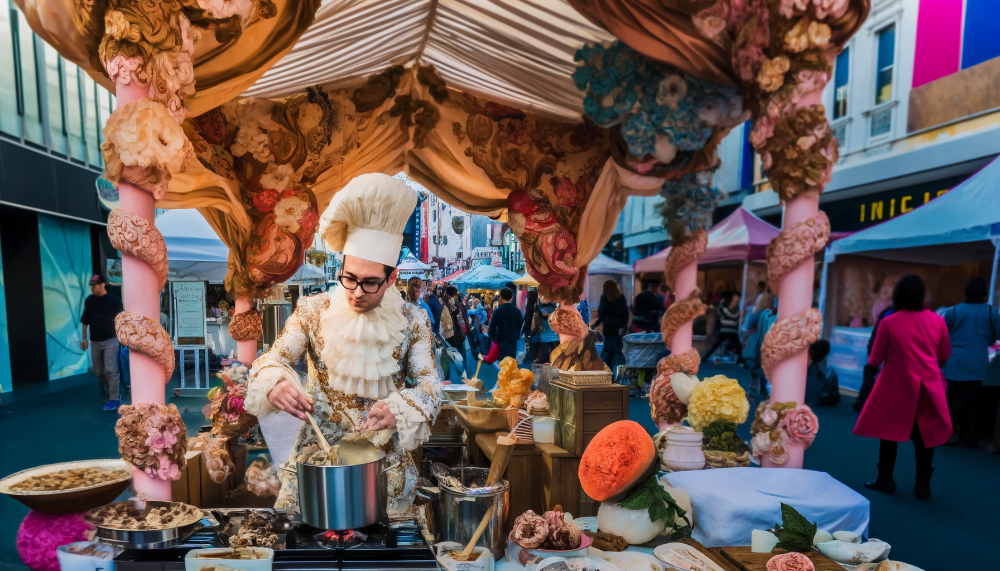
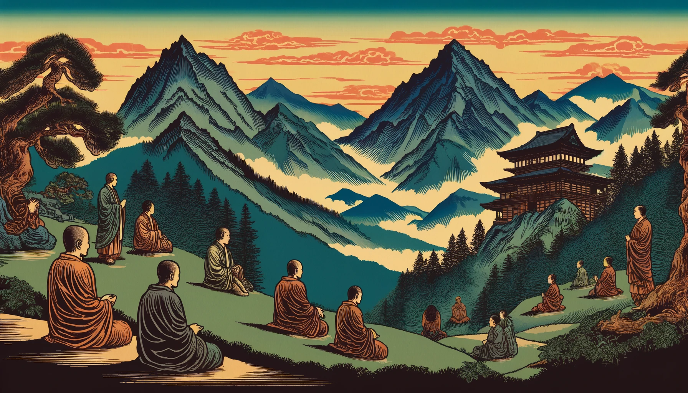

## 0. Introduction | 前言

### 0.1 Core Concept | 核心思想

As a former architectural designer transitioning into the tech industry, I deeply appreciate AI's profound effect on visual representation. During my graduate studies in Advanced Architectural Design at the University of Pennsylvania, a notable saying circulated: "Fake it til you make it," highlighting the iterative and experimental nature of design and innovation. This philosophy resonates with my experience, where architectural education often emphasized theoretical exploration over real-world execution.

During seven years of architectural education, I gradually realized that design is fundamentally about control – the extent to which a designer can guide the final outcome to align with their original vision. Ironically, within the academic setting, the design studio often became focused on handcrafted workflows aided by digital software – an approach increasingly anachronistic in the information era. With designs detached from actual construction, our work was reduced to images adorning gallery walls during final presentations. This made me question the value and significance of our efforts in a world where countless creative projects are shared on platforms like Pinterest, yet rarely make any tangible impact beyond serving as memorials to unrealized ideas.

The "Visual Prompt 101" document serves as a comprehensive guide for leveraging generative AI tools effectively. Centered around the core concept that "Prompt is all your need," it introduces the art of crafting powerful prompts to harness the full potential of AI creativity.

This introduction emphasizes smart strategies for prompt generation, utilizing the vast dictionary provided in the tables. It offers templates and examples for combining words into meaningful, concise, and imaginative prompts, encouraging users to explore the synergy between diverse elements such as emotions, professions, materials, and more.

These techniques aim to inspire users to experiment and discover unique prompt formulations that unlock new realms of digital art and design.

作为一名从建筑设计领域转型到科技行业的前设计师，我深刻体会到人工智能对视觉表现力的深远影响。当我在宾夕法尼亚大学攻读高级建筑设计硕士学位期间，学院里一句名言广为流传："先假手于前,俟后真乃功"。这句话强调了设计与创新的迭代性和实验性本质。这句话也引起了我的共鸣，因为在建筑教育中，往往更侧重于理论探索而非现实世界的实践落地。

在七年的建筑教育中，我逐渐意识到设计从根本上来说是一种对结果的把控——引导设计过程的能力，使最终成果与最初构想相一致。讽刺的是，在学术背景下，设计工作室往往专注于由数字软件辅助的手工工作流程——这种方法在信息时代日益显露出过时的迹象。由于设计与实际建造分离，我们的作品在期末展示时被简化为装饰画廊墙壁的图像。这让我质疑我们工作的价值和意义，因为无数的创意项目被分享在像 Pinterest 这样的平台上，除了成为未实现想法的纪念碑以外，几乎没有任何实际影响。

《视觉提示词 101》文档是有效利用生成式人工智能工具的综合指南。它围绕核心概念“提示词就是你所需要的一切”，介绍了设计强大提示以发挥人工智能创造潜力的艺术。

本导言强调了提示生成的智能策略，利用表格中提供的庞大词典。它提供了将单词组合成有意义、简洁和富有想象力的提示的模板和示例，鼓励用户探索不同元素之间的协同作用，例如情感、职业、材料等等。

这些技术旨在激发用户进行实验，并找到独特新颖的提示表述，从而开辟数字艺术和设计的新领域。

### 0.2 Example Prompt Template | 案例提示词模板

To create fantastic prompts using words from the tables, consider combining elements from different categories like emotions, professions, and environments. For instance:

要使用表格中的单词创建精彩的提示，请考虑结合不同类别的元素，例如情感、职业和环境。 例如：

1. **[Emotion] + [Profession]**:
   **[情感] + [职业]**:
   "A joyful artist creating in a sunlit studio" merges an emotion from the "Emotions and Expressions" table with a profession from the "Professions and Roles" table, setting a vivid scene.
   “一位快乐的艺术家在阳光照射的工作室里创作”将“情感与表达”表中的情感与“职业与角色”表中的职业融为一体，营造出生动的场景。

   

2. **[Environment] + [Action]**:
   **[环境] + [动作]**:
   "A serene forest where ancient trees whisper secrets" combines an environment from the "Physical Features and Characteristics" table with a creative action, painting an imaginative picture.
   “古树低语的宁静森林”将“物理特征和特征”表中的环境与创意动作结合起来，描绘出一幅充满想象力的图画。

   

3. **[Material] + [Object]**:
   **[材质] + [物体]**:
   "A shimmering dress of woven light, defying gravity" uses materials from the "Materials and Textures" table with an object, offering a futuristic concept.
   “一件闪闪发光的编织光连衣裙，挑战重力”使用“材料和纹理”表中的材料和物体，提供了未来主义的概念。

   

4. **[Art Style/Movement] + [Character/Role] + [Environment]**:
   **[美术风格/动作] + [角色/角色] + [环境]**：
   "A Rococo-inspired chef crafting delicacies in a bustling street market."
   “一位洛可可风格的厨师在熙熙攘攘的街头市场上制作美味佳肴。”

   

5. **[Material/Texture] + [Object] + [Lighting Effect]**:
   **[材质/纹理] + [物体] + [灯光效果]**:
   "A velvet gown under soft neon lights, casting enigmatic shadows."
   “柔和的霓虹灯下的天鹅绒礼服，投射出神秘的阴影。”

   

6. **[Emotion/Expression] + [Action/Activity] + [Setting]**:
   **[情绪/表情] + [动作/活动] + [设置]**:
   "A solitary explorer, jubilant upon discovering an untouched forest at dawn."
   “一位孤独的探险家，在黎明时分发现了一片未受破坏的森林而欣喜若狂。”

   

7. **[Cultural Theme] + [Special Effect/Technical Term] + [Action/Activity]**:
   **[文化主题] + [特效/专业术语] + [动作/活动]**：
   "A samurai battle scene enhanced with dramatic contrast and motion blur in a cherry blossom grove."
   “樱花林中的武士战斗场景通过戏剧性的对比度和运动模糊而增强。”

   

8. **[Profession/Role] + [Material/Texture] + [Artistic Style/Movement]**:
   **[职业/角色] + [材质/质感] + [艺术风格/动作]**：
   "A cybernetic warrior with a carbon fiber armor, portrayed in a Futurist style."
   “一个穿着碳纤维盔甲的控制论战士，以未来主义风格描绘。”

   

9. **[Weather/Natural Phenomenon] + [Emotion/Expression] + [Composition Technique]**:
   **[天气/自然现象] +[情感/表情] +[构图技巧]**：
   "A thunderstorm evoking a sense of despair, captured through a low-angle shot."
   “通过低角度拍摄捕捉到的雷暴唤起了绝望感。”

   

10. **[Physical Feature] + [Action/Activity] + [Cultural/Historical Reference]**:
    **[外貌特征] + [动作/活动] + [文化/历史参考]**:
    "Majestic mountains where ancient monks meditate, inspired by traditional Ukiyo-e art."
    “受传统浮世绘艺术启发，古代僧人在雄伟的山脉中冥想。”

    

11. **[Sports/Physical Activity] + [Setting] + [Time of Day/Natural Light]**:
    **[运动/体力活动] + [设置] + [时间/自然光]**：
    "A serene yoga session on a secluded beach at golden hour."
    “黄金时段在僻静的海滩上享受宁静的瑜伽课程。"

    

12. **[Specialized Lighting Effect] + [Artistic Style/Movement] + [Object]**:
    **[专业灯光效果] +[艺术风格/动作] +[物体]**：
    "A Gothic gloomy realism painting of an abandoned mansion, illuminated by crepuscular rays."
    “一幅哥特式阴郁现实主义绘画，描绘的是一座废弃的宅邸，被黄昏的光线照亮。”

    

13. **[Animal/Character] + [Emotion/Expression] + [Unconventional Role/Activity]**:
    **[动物/角色] + [情感/表情] + [非常规角色/活动]**:
    "An adventurous cat, curious and determined, embarking on a space mission."
    “一只富有冒险精神的猫，好奇而坚定，开始执行太空任务。”

    

---
