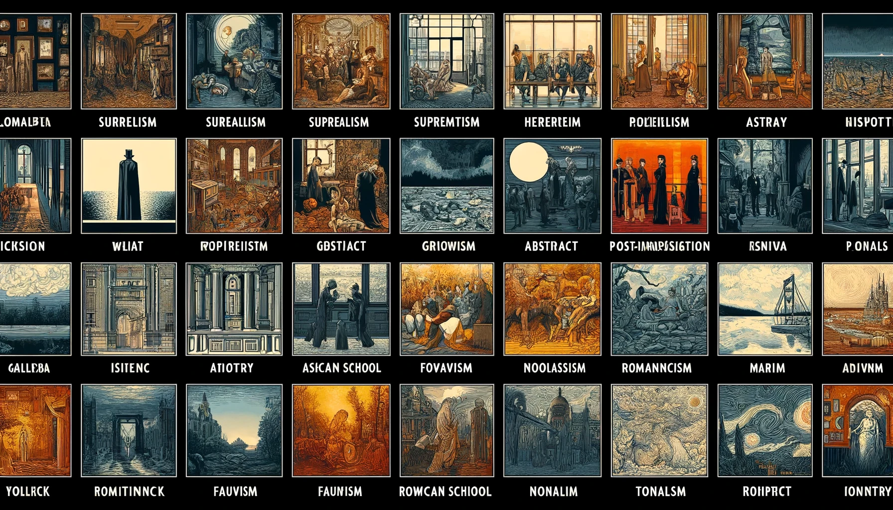
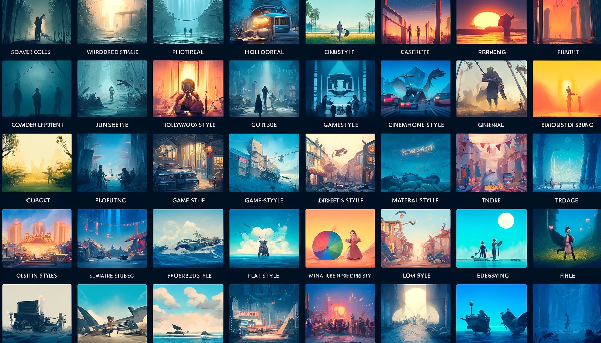
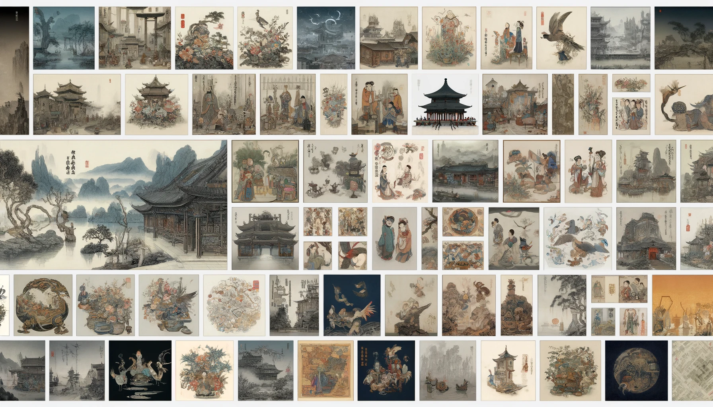
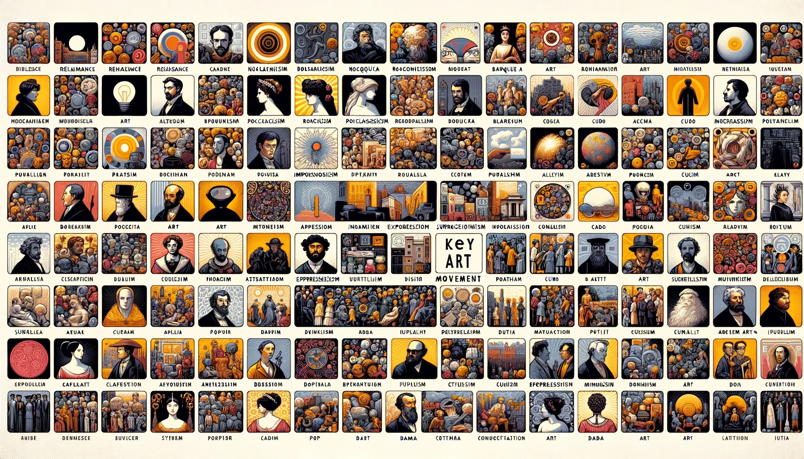
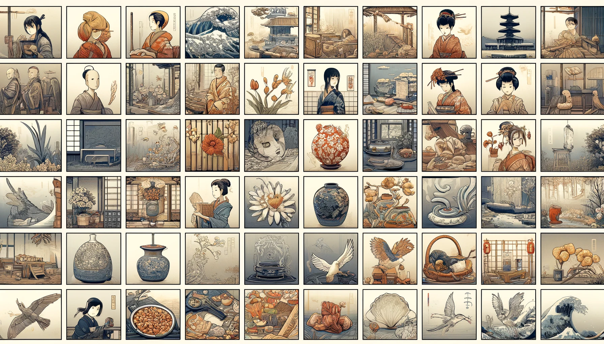
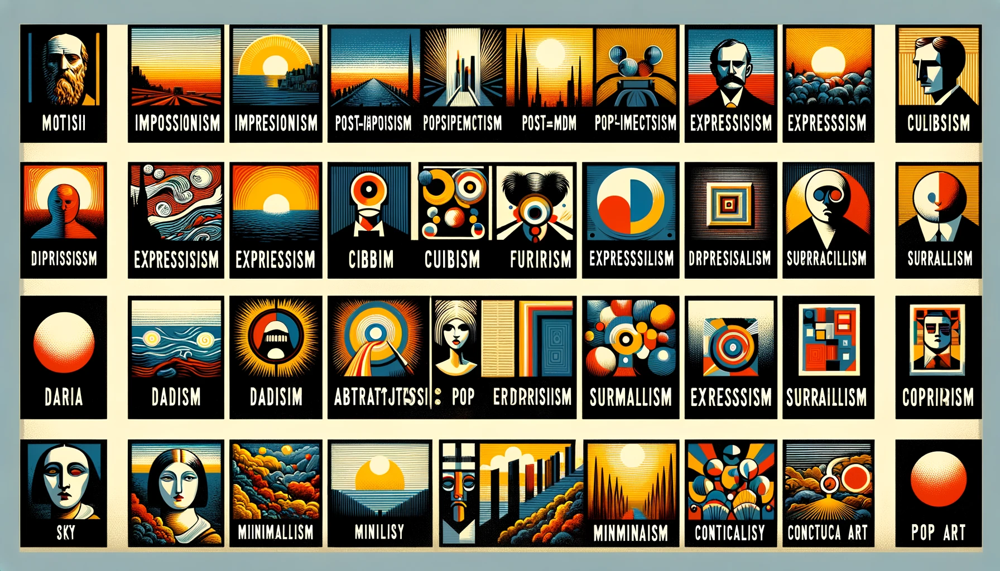
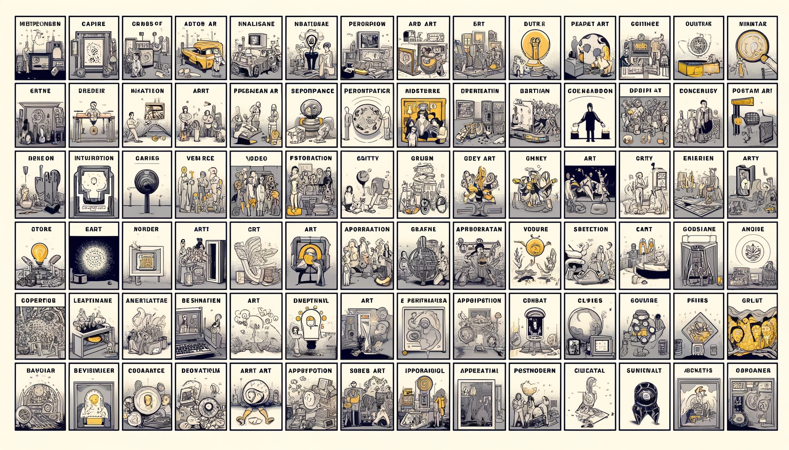
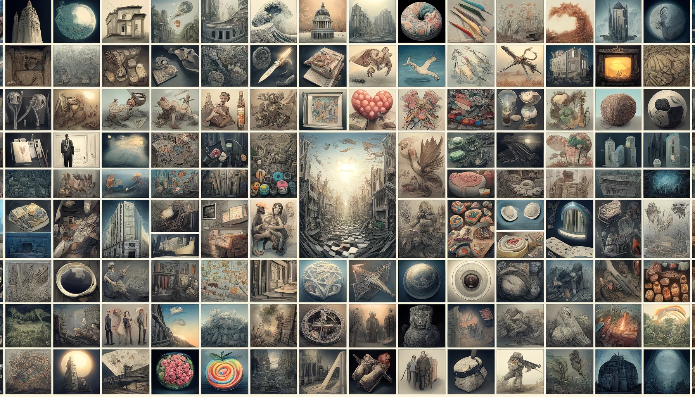

## 1. Artistic Styles and Movements | 艺术风格和潮流

### 1.1 Art Movements and Styles | 艺术运动和风格

| English Term          | Chinese Term     |
| --------------------- | ---------------- |
| Surrealism            | 超现实主义       |
| Suprematism           | 极简主义         |
| Post-Impressionism    | 后印象派         |
| Hyperrealism          | 超现实主义       |
| Abstract              | 抽象             |
| Gothic gloomy realism | 哥特阴郁现实主义 |
| Ashcan School         | 灰盒派           |
| Neoclassical          | 新古典主义       |
| Fauvism               | 野兽派           |
| Romanticism           | 浪漫主义         |
| Minimalism            | 极简主义         |
| Tonalism              | 色调主义         |
| Color Field painting  | 色域绘画         |

### 1.2 Design Styles and Techniques | 设计风格和技巧

| English Term          | Chinese Term |
| --------------------- | ------------ |
| Photoreal             | 照片般逼真   |
| Hollywood-style       | 好莱坞风格   |
| Game-style            | 游戏风格     |
| Cinematic             | 电影化       |
| Cinematography style  | 电影摄影风格 |
| Miniature movie style | 微缩电影风格 |
| Disney-style          | 迪士尼风格   |
| Flat design           | 扁平化设计   |
| Material Design       | 材料设计     |
| Modern-style          | 现代风格     |
| Immersive design      | 沉浸式设计   |

### 1.3 Chinese Art Styles | 中国艺术风格

| English Term             | Chinese Term |
| ------------------------ | ------------ |
| Ink and Wash Painting    | 水墨画       |
| Gongbi Painting          | 工笔画       |
| Bird-and-Flower Painting | 花鸟画       |
| Figure Painting          | 人物画       |
| Landscape Painting       | 山水画       |
| Court Painting           | 宫廷画       |
| Buddhist Painting        | 佛教绘画     |
| Literati Painting        | 文人画       |
| Folk Painting            | 民间绘画     |
| Dunhuang Murals          | 敦煌壁画     |
| Mogao Caves Murals       | 莫高窟壁画   |
| Yongle Palace Murals     | 永乐宫壁画   |
| Fahai Temple Murals      | 法海寺壁画   |
| Gu Kaizhi                | 顾恺之       |
| Wu Daozi                 | 吴道子       |
| Wang Wei                 | 王维         |
| Li Sixun                 | 李思训       |
| Guo Xi                   | 郭熙         |
| Fan Kuan                 | 范宽         |
| Zhao Mengfu              | 赵孟頫       |
| The Four Wangs           | 四王         |
| Calligraphy              | 书法         |
| Seal Carving             | 篆刻         |
| Porcelain                | 瓷器         |
| Jade Carving             | 玉雕         |
| Lacquerware              | 漆器         |
| Cloisonné                | 景泰蓝       |
| Woodblock Printing       | 木刻版画     |
| Paper Cutting            | 剪纸         |
| Embroidery               | 刺绣         |
| Tapestry (Kesi)          | 缂丝         |
| Shadow Puppetry          | 皮影戏       |

### 1.4 European Art Styles | 欧洲艺术风格

| English Term           | Chinese Term        |
| ---------------------- | ------------------- |
| Renaissance Art        | 文艺复兴艺术        |
| Baroque Art            | 巴洛克艺术          |
| Rococo Art             | 洛可可艺术          |
| Neoclassicism          | 新古典主义          |
| Romanticism            | 浪漫主义            |
| Impressionism          | 印象主义            |
| Post-Impressionism     | 后印象主义          |
| Expressionism          | 表现主义            |
| Cubism                 | 立体主义            |
| Futurism               | 未来主义            |
| Dada                   | 达达主义            |
| Surrealism             | 超现实主义          |
| Abstract Expressionism | 抽象表现主义        |
| Pop Art                | 波普艺术            |
| Minimalism             | 极简主义            |
| Conceptual Art         | 概念主义            |
| Emiliano Ponzi Style   | 埃米利亚诺·庞齐风格 |
| Eric Carle             | 埃里克·卡尔         |
| Herge                  | 埃尔热              |
| Jon Klassen            | 乔恩·克拉森         |
| Claude Monet           | 克劳德·莫奈         |

### 1.5 Japan Art Styles | 日本艺术风格

| English Term               | Chinese Term     |
| -------------------------- | ---------------- |
| Nihonga                    | 日本画           |
| Ukiyo-e                    | 浮世絵           |
| Sumi-e                     | 水墨画           |
| Ceramics                   | 陶器             |
| Calligraphy                | 書道             |
| Sculpture                  | 彫刻             |
| Architecture               | 建築             |
| Garden Design              | 庭園設計         |
| Ikebana                    | 生け花           |
| Tea Ceremony               | 茶道             |
| Bonsai                     | 盆景             |
| Origami                    | 折纸             |
| Kimono                     | 和服             |
| Kabuki                     | 歌舞伎           |
| Noh                        | 能               |
| Rakugo                     | 落語             |
| Haiku                      | 俳句             |
| Tanka                      | 短歌             |
| Woodblock printing         | 木版画           |
| Lacquerware                | 漆器             |
| Metalwork                  | 金属加工         |
| Textiles                   | 纺织品           |
| Jōmon pottery              | 绳文陶器         |
| Yayoi pottery              | 弥生陶器         |
| Kofun period art           | 古坟时代艺术     |
| Asuka period art           | 飞鸟时代艺术     |
| Nara period art            | 奈良时代艺术     |
| Heian period art           | 平安时代艺术     |
| Kamakura period art        | 镰仓时代艺术     |
| Muromachi period art       | 室町时代艺术     |
| Azuchi-Momoyama period art | 安土桃山时代艺术 |
| Edo period art             | 江户时代艺术     |
| Meiji period art           | 明治时代艺术     |
| Taisho period art          | 大正时代艺术     |
| Showa period art           | 昭和时代艺术     |
| Heisei period art          | 平成时代艺术     |
| Reiwa period art           | 令和时代艺术     |
| Manga                      | 漫画             |
| Anime                      | 动漫             |
| Cel Animation              | 赛璐璐动画       |
| Shōnen                     | 少年漫画         |
| Shōjo                      | 少女漫画         |
| Kawaii Art                 | 可爱艺术         |
| Moe                        | 萌               |
| Chibi                      | Q 版             |
| Super Deformed (SD)        | 超级变形         |
| Superflat                  | 超扁平           |
| Makoto Shinkai's Style     | 新海诚风格       |

### 1.6 Modern Art Styles | 现代艺术风格

| English Term           | Chinese Term |
| ---------------------- | ------------ |
| Impressionism          | 印象主义     |
| Post-Impressionism     | 后印象主义   |
| Expressionism          | 表现主义     |
| Cubism                 | 立体主义     |
| Futurism               | 未来主义     |
| Dada                   | 达达主义     |
| Surrealism             | 超现实主义   |
| Abstract Expressionism | 抽象表现主义 |
| Pop Art                | 波普艺术     |
| Minimalism             | 极简主义     |
| Conceptual Art         | 概念主义     |

### 1.7 Contemporary Art Styles | 当代艺术风格

| English Term      | Chinese Term |
| ----------------- | ------------ |
| Installation Art  | 装置艺术     |
| Performance Art   | 行为艺术     |
| Video Art         | 录像艺术     |
| Digital Art       | 数字艺术     |
| Street Art        | 街头艺术     |
| Graffiti          | 涂鸦         |
| Appropriation Art | 挪用艺术     |
| Postmodern Art    | 后现代艺术   |
| Global Art        | 全球艺术     |

### 1.8 Miscellaneous Concepts and Innovations | 其他概念和创新

| English Term            | Chinese Term |
| ----------------------- | ------------ |
| Magic realism           | 魔幻现实主义 |
| National Geographic     | 国家地理     |
| En plein air            | 户外写生     |
| Architectural sketching | 建筑草图     |
| Subsurface scattering   | 次表面散射   |
| Black and white         | 黑白         |
| Fashion                 | 时尚         |
| Eco-friendly-style      | 环保风格     |
| Social realism          | 社会现实主义 |
| Skeuomorphism           | 拟物化设计   |
| Brutalist               | 残酷主义     |
| Constructivist          | 结构主义     |
| Weapon design           | 武器设计     |
| Concept art             | 概念艺术     |

---
