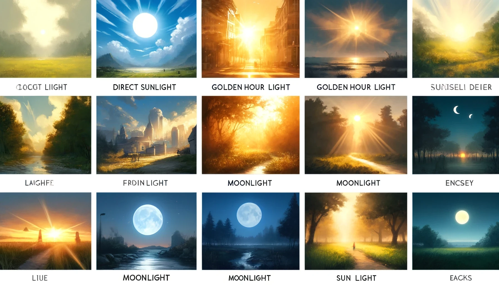
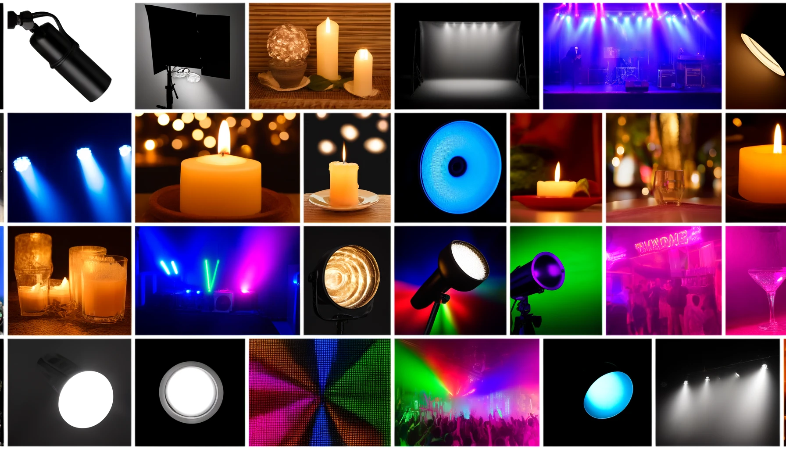
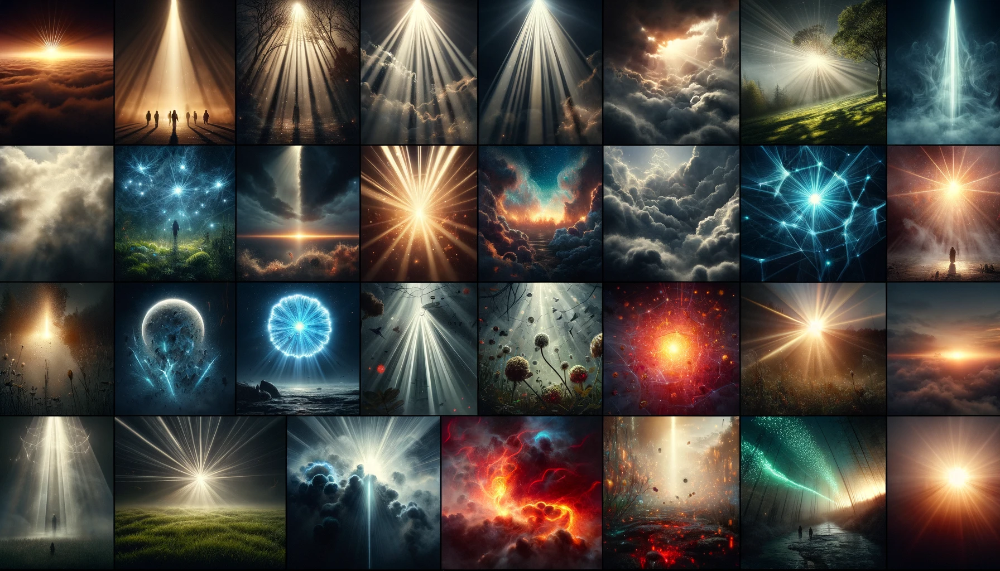

## 2. Lighting and Atmosphere | 光影和氛围

### 2.1 Natural Light | 自然光

| English Term      | Chinese Term   |
| ----------------- | -------------- |
| Direct Sunlight   | 直射阳光       |
| Golden Hour Light | 金色时光的光线 |
| Moonlight         | 月光           |
| Sun Light         | 阳光           |

### 2.2 Artificial Light | 人造光

| English Term       | Chinese Term |
| ------------------ | ------------ |
| Accent Lighting    | 重点照明     |
| Blacklight         | 紫外线照明   |
| Candlelight        | 烛光         |
| Concert Lighting   | 音乐会照明   |
| Studio Lighting    | 摄影棚照明   |
| Fluorescent        | 荧光         |
| Glow-stick         | 荧光棒       |
| Neon Lamp          | 霓虹灯       |
| Spotlight          | 聚光灯       |
| Strobe Light       | 频闪灯       |
| Nightclub Lighting | 夜店照明     |

### 2.3 Specialized Lighting Effects | 特殊灯光效果

| English Term        | Chinese Term |
| ------------------- | ------------ |
| Backlight           | 背光         |
| Crepuscular Rays    | 暮光射线     |
| Rim Light           | 边缘光       |
| Volumetric Lighting | 体积光       |
| Glowing             | 发光的       |
| Glow Radioactive    | 放射性荧光   |
| Lava Glow           | 熔岩光辉     |
| Nuclear Waste Glow  | 核废料发光   |
| Edge Light          | 边缘光       |
| Key Lighting        | 主光源照明   |
| Ambient Light       | 环境光       |
| High Key Lighting   | 高调照明     |
| Low Key Lighting    | 低调照明     |
| Motivated Lighting  | 动机照明     |
| 3 Point Lighting    | 三点照明     |
| Ultraviolet         | 紫外线       |
| Moody Lighting      | 情绪照明     |
| Beautiful Lighting  | 美丽的照明   |
| Soft Lighting       | 柔和照明     |
| Quantum Dot         | 量子点       |
| Dust                | 灰尘         |

## 
