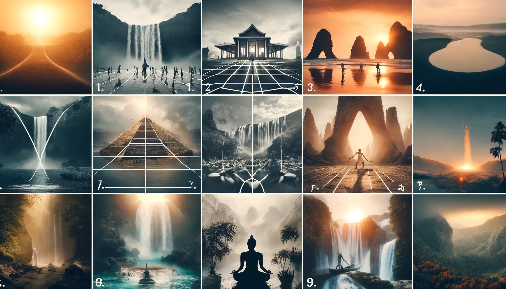
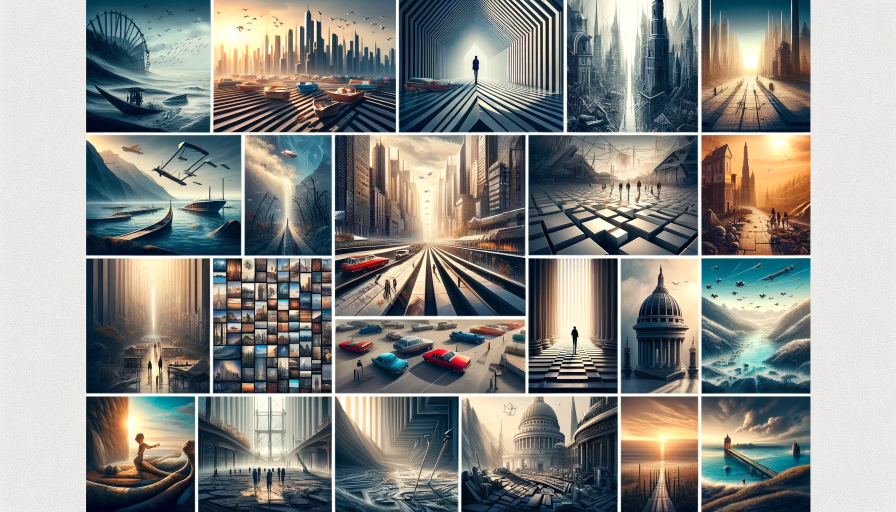
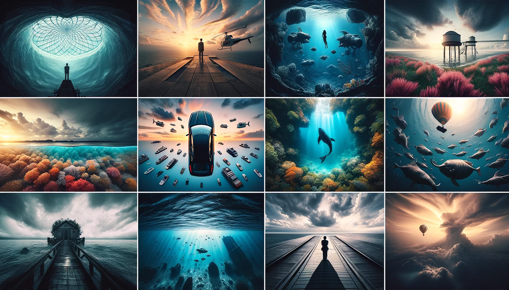
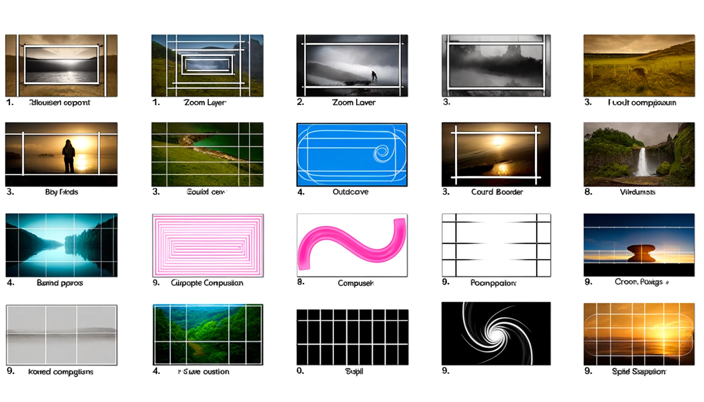
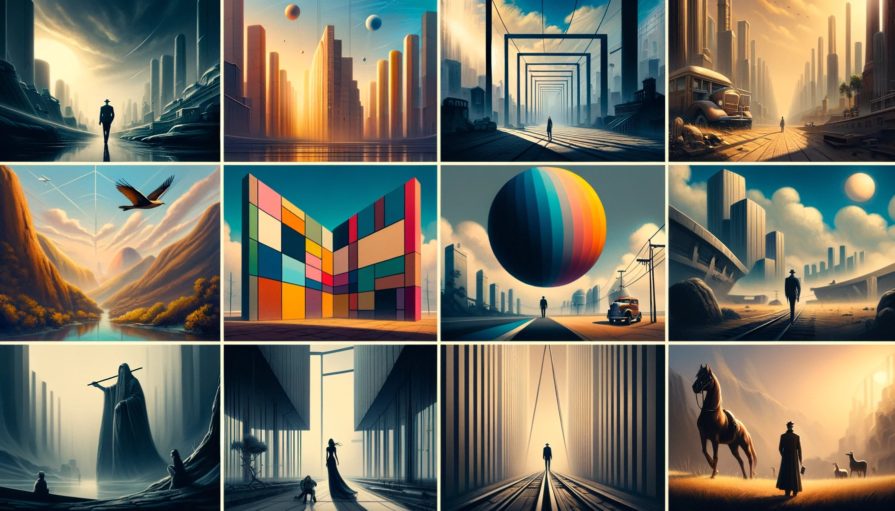

## 3. Composition and Framing | 构图和取景

### 3.1 Basic Compositional Techniques | 基本构图技巧

| English Term               | Chinese Term |
| -------------------------- | ------------ |
| Rule of Thirds Composition | 三分法构图   |
| Symmetrical Composition    | 对称构图     |
| Asymmetrical Composition   | 不对称构图   |
| Diagonal Composition       | 对角线构图   |
| Golden Ratio Composition   | 黄金比例构图 |
| Central Composition        | 中央构图     |
| Balance Composition        | 平衡构图     |
| High Angle Shot            | 高角度拍摄   |
| Low Angle Shot             | 低角度拍摄   |
| Eye-Level Shot             | 眼平视角拍摄 |

### 3.2 Advanced Composition Techniques | 高级构图技巧

| English Term                        | Chinese Term   |
| ----------------------------------- | -------------- |
| Dynamic Symmetry Composition        | 动态对称构图   |
| Vanishing Point Composition         | 消失点构图     |
| Leading Lines Composition           | 引导线构图     |
| Juxtaposition Composition           | 并置构图       |
| Converging Lines Composition        | 汇聚线条构图   |
| Depth of Field Composition          | 景深构图       |
| Framing Composition                 | 框架构图       |
| Frame within a Frame Composition    | 框中框构图     |
| Overlapping Elements Composition    | 元素重叠构图   |
| Repetition and Patterns Composition | 重复与图案构图 |
| Negative Space Composition          | 负空间构图     |
| Foreground Interest Composition     | 前景兴趣点构图 |
| Background Separation Composition   | 背景分离构图   |

### 3.3 Specific Shots and Angles | 特定镜头和角度

| English Term                | Chinese Term   |
| --------------------------- | -------------- |
| Overhead Shot Composition   | 俯视图构图     |
| Partially Underwater Shot   | 部分水下拍摄   |
| Silhouette Composition      | 轮廓构图       |
| Macro Shot Composition      | 微距拍摄构图   |
| Panoramic Composition       | 全景构图       |
| Bird's Eye View Composition | 鸟瞰图构图     |
| Worm's Eye View Composition | 虫视图构图     |
| Tilted Horizon Composition  | 倾斜地平线构图 |

### 3.4 Composition Based on Shapes and Lines | 基于形状和线条的构图

| English Term              | Chinese Term |
| ------------------------- | ------------ |
| Zoom Layer                | 缩放层       |
| Point of View Composition | 视点构图     |
| Outside Border            | 外边框       |
| Rounded Corners           | 圆角         |
| Cross Composition         | 交叉构图     |
| S-Curve Composition       | S 型曲线构图 |
| Z-Curve Composition       | Z 型曲线构图 |
| Radial Composition        | 径向构图     |
| Spiral Composition        | 螺旋构图     |

### 3.5 Composition Based on Visual Effects | 基于视觉效果的构图

| English Term               | Chinese Term |
| -------------------------- | ------------ |
| Complementary Composition  | 补色构图     |
| Color Blocking Composition | 色块构图     |
| Sequential Composition     | 序列构图     |
| Perspective Composition    | 透视构图     |
| Isolation Composition      | 分离构图     |
| Foreground Framing         | 前景框架     |
| Horizontal Composition     | 水平构图     |
| Vertical Composition       | 垂直构图     |

---
